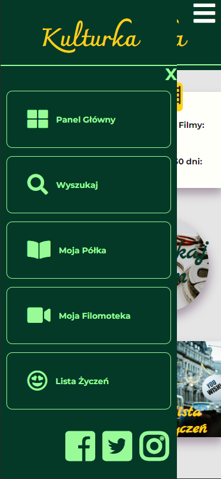
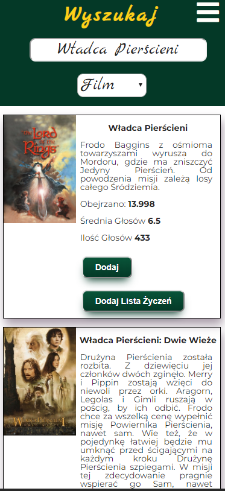
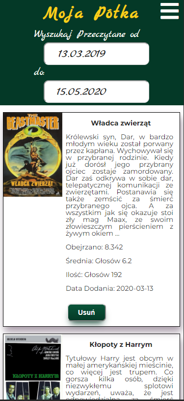
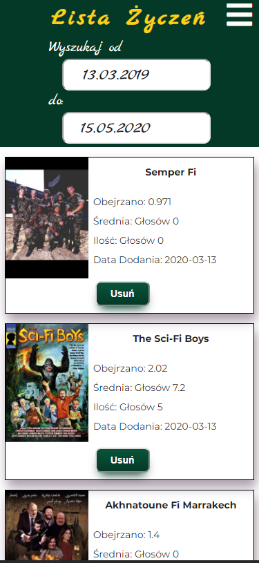

# Kulturka
Link to site: https://mkusmierczyk.github.io/Kulturka/build/#/
## Table of contents
* [General info](#general-info)
* [Screenshots](#screenshots)
* [Technologies](#technologies)
* [Setup](#setup)
* [Features](#features)
* [Status](#status)

* [Inspiration](#inspiration)
* [Contact](#contact)

## General info
It's a  application for searching movies and books. You can add movie/book to wish list, book Shelf or film library. 
Everything is saved on JSON server, so you can always come back to your movies and books filter them and delete if you want.

This was a final front-end project in CodersLab.

## Screenshots

###Application View

### Search View

### My Book Shelf View

### My Movies View

### Wish List View

## Technologies
* REACT
* HTML - version 5.0
* CSS - version 4.0
* Sass -  with Gulp Tool
* Json Server
## Setup

How to start:

To start development follow this instruction:

* `clone` this repo
* `npm install` all necessary npm packages
* `npm start` project
* `json-server --watch db.json` to start json server in localization  development\database

## Features
List of features ready and TODOs for future development
* Counting books and movies added in 30 days and all
* Searching movies in API
* adding movies to JSON server
* adding to chosen list: my_movies, my_shelf, wishList
* deleting from the list
* filtering lists

To-do list:
* Schedule display in Application View
* adding books API
* adding how long you watch movies widget

## Status
Project is: _in progress_, 

## Inspiration
I coould not find aplication like this in application shop, so I made my own

## Contact
Created by Mateusz Kusmierczyk. Feel free to contact me!

